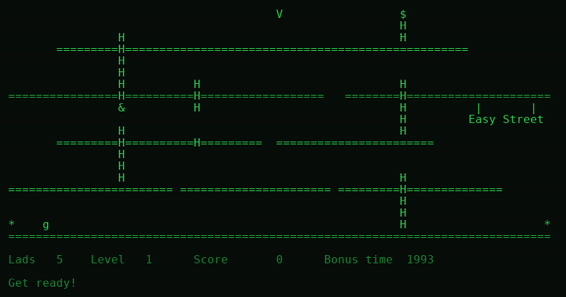

# VAX Ladder

A port of the 1982 CP/M arcade game **Ladder** (originally by Yahoo Software)
to **OpenVMS/VAX**, written in C for real DEC terminals.



*Easy Street, rendered green-phosphor style — climb the ladders, dodge the
falling Der rocks, and reach the treasure.*

It is an 80×24 character game: climb ladders, grab the statues (`&`), reach the
treasure (`$`) to finish each level, and don't get flattened by the falling
"Der" rocks (`o`) or burned by fire (`^`). Seven levels cycle with a rising
hidden difficulty, exactly like the original.

The mechanics are ported faithfully from three earlier reimplementations —
[mecparts' Turbo Pascal port](https://github.com/mecparts/Ladder),
Stephen Ostermiller's [Java version](https://ostermiller.org/ladder/), and
Elliot Nelson's [ladderjs](https://github.com/eanelson/ladderjs) — giving you
pac-man-style queued movement, jump arcs, crumbling floors, trampolines,
bonus-time-into-score, an extra life every 10,000 points, and the five
selectable play speeds. The idle taunts ("You eat quiche!"), the "Get ready!"
and "Hooka!" call-outs, and the "YAHOO!" end-of-cycle congratulations are all
from the original.

## Getting it onto the VAX

Copy the whole `vaxladder` directory (sources, `BUILD.COM`, `DESCRIP.MMS`) to
your VAX — for example with `git`, Kermit, FTP, or a shared disk. The tree only
needs the plain-text sources; nothing is pre-generated. A convenient layout is:

```
$ CREATE/DIRECTORY [.VAXLADDER.SRC]
```

with the `.c`/`.h` files in `[.VAXLADDER.SRC]` and `BUILD.COM` in `[.VAXLADDER]`.

## Building on OpenVMS/VAX

You need DEC C / Compaq C / VSI C (it also compiles with older VAX C).
From the `[.VAXLADDER]` directory:

```
$ @BUILD
```

or, if you have MMS/MMK:

```
$ MMS
```

This produces `LADDER.EXE` (the game), `LADCONF.EXE` (the configurator), and
`KEYCODE.EXE` (a small terminal-key diagnostic — see Troubleshooting).

## First run: configure your terminal

Like the original CP/M game's `LADCONF`, a small setup program writes a
`LADDER.DAT` file describing your terminal and your movement keys:

```
$ RUN LADCONF
```

It asks for:

- **Terminal type** — picks the cursor-addressing and clear-screen escape
  sequences. Built-in choices: `VT100`, `VT220`, `ANSI`, `VT52`, `ADM3A`
  (the Kaypro II's built-in terminal), and `H19`. Any real DEC terminal is
  the `VT100` choice.
- **Movement keys**, pause/quit keys, and speed keys.
- **Sound** (terminal bell) on/off and default play speed.

Then play:

```
$ RUN LADDER
```

If `LADDER.DAT` is missing, `LADDER` still runs using VT100 defaults, so on a
VT-series terminal you can skip `LADCONF` entirely.

To make them foreign commands:

```
$ LADDER  == "$" + F$ENVIRONMENT("DEFAULT") + "LADDER.EXE"
$ LADCONF == "$" + F$ENVIRONMENT("DEFAULT") + "LADCONF.EXE"
```

## Controls (defaults)

```
  I / K / J / L    up / down / left / right   (arrow keys and WASD also work)
  SPACE            jump
  P                pause  (P or RETURN resumes)
  + / -            faster / slower
  Q                quit to the menu (again at the menu to exit)
```

## Troubleshooting

**Arrow keys** — the game understands the arrow keys in every form a DEC
terminal is likely to send them: 7-bit `ESC [ A` (CSI) and `ESC O A` (SS3),
8-bit C1 (`0x9B` / `0x8F`), and even the bare `[ A` / `O A` you get when the
OpenVMS terminal driver swallows the leading `ESC`. `I/K/J/L` and `WASD` always
work too, so you never depend on arrows.

If a key ever misbehaves, run the built-in reporter and press the key in
question — it prints the exact byte(s) your terminal sends, through the same
input path the game uses:

```
$ RUN KEYCODE          ! press keys to see their codes; press Q to quit
```

## Why it plays smoothly over a serial line

Terminals on a MicroVAX are often 1200–9600 baud. Redrawing the whole 80×24
screen every frame would be far too slow, so the terminal layer keeps an
off-screen buffer and, each frame, sends **only the cells that changed** plus
the cursor moves to reach them (see `src/term.c`). Everything OS-specific —
raw `$QIO` keyboard polling, raw terminal writes, and `LIB$WAIT` frame pacing —
is isolated in `src/plat_vms.c`.

## Source layout

| File            | Purpose |
|-----------------|---------|
| `src/game.c`    | Game mechanics, menus, and the main loop (portable C). |
| `src/levels.c`  | The 7 level layouts (generated from the reference data). |
| `src/term.c/.h` | Terminal capability formatting + 80×24 differential renderer. |
| `src/config.c`  | `LADDER.DAT` load/save and the built-in terminal presets. |
| `src/ladconf.c` | The configuration program. |
| `src/keycode.c` | Terminal key-code reporter (`KEYCODE.EXE`), for diagnostics. |
| `src/plat.h`    | Tiny platform interface (raw key, raw write, wait, clock). |
| `src/plat_vms.c`| OpenVMS implementation (`$QIO`, `LIB$WAIT`, `SYS$GETTIM`). |
| `src/plat_posix.c` | POSIX implementation, for developing/testing on Unix. |
| `src/ladder.h`  | Shared types, tuning constants, and the config record. |

## Developing on Unix

The same game logic builds and runs on a modern Unix box (handy for testing
changes before copying to the VAX), using the POSIX platform backend:

```
$ make            # builds ./ladder and ./ladconf
$ make run
```

Only the platform file differs between the two targets; everything above
`plat.h` is shared, byte-for-byte, with the VMS build.

## License

Copyright (C) 2026 Joe (n9tax). Released under the **GNU General Public
License, version 3 or later** — see [LICENSE](LICENSE). This is a clean-room-ish
reimplementation informed by the earlier open-source ports credited above;
the original *Ladder* was written by Yahoo Software in 1982.
